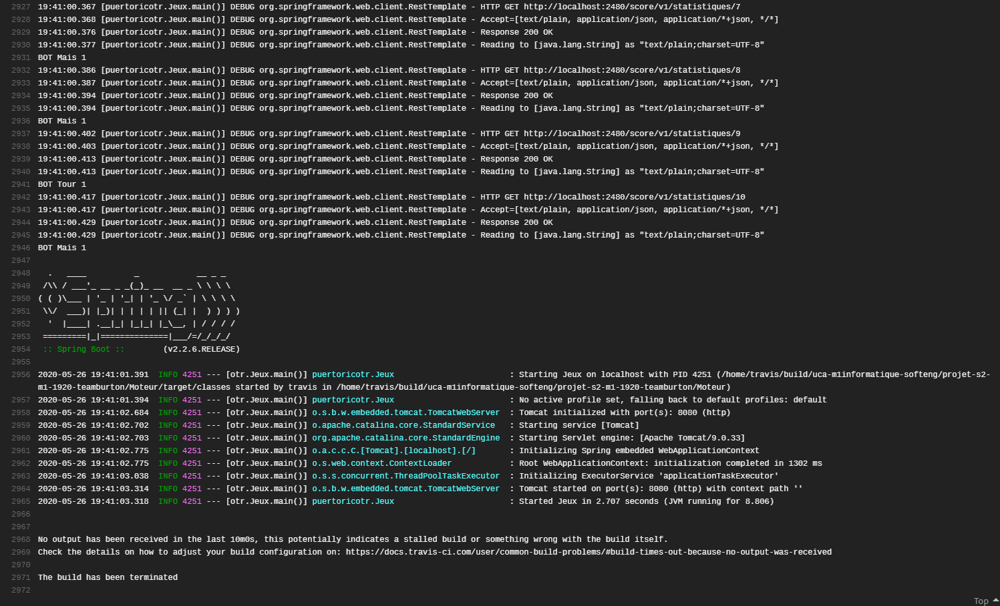

# <H1>PUERTO RICO JEUX DE SOCIETE</H1>

 

 
# <H1>Démonstration</H1>
- *Fonctionnement et utilisation de Docker*
- *Plan de builds dans Travis*
- *Images d'exécutions*

## Fonctionnement et utilisation de Docker
  *Notre conteneur Docker contient le serveur de stat dont le port 2480 est mappé au port 2480 de la machine exécutant le projet afin d'éviter un conflit d'utilisation de port avec le moteur de jeu qui communique par le port 8080 de la machine exécutant le projet.*

## Plan de build dans Travis
  *1_ Définition du langage et JDK utilisé* 
  *2_ Build des deux projets contenant les applications springboot* 
  *3_ Exécution des tests du moteur de jeu* 
  *4_ Construction de l'image Docker "servveur" contenant l'application SpringBoot du serveur de stat* 
  *5_ Exécution de l'image Docker et connexion du port 8080 de la machine physique au port 2480 de la VM* 
  *6_ Exécution de l'application SpringBoot "Moteur" qui est notre moteur de jeu (celui-ci exécute 10 parties et requiert le service de sauvegarde du serveur de stat à la fin de chacune pour enregistrer le vainqueur de chaque partie)* 

## Images d'exécutions
 

 
 

 
